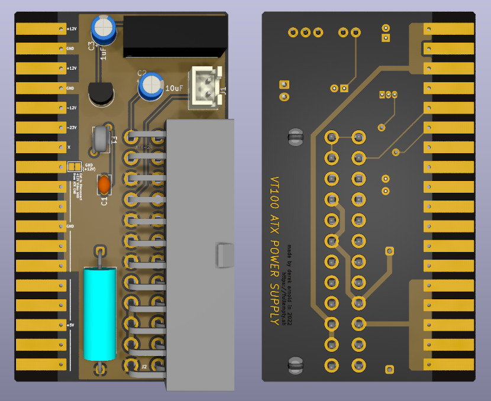

VT100 ATX Adapter
-----------------

Like others with DEC VT10X terminals, the power supply board in mine
wasn't working. I've started off with bbenchoff's [here](https://github.com/bbenchoff/VT100Adapter),
but had to modify it to make it work with my VT105, which is essentially
a stock VT100 with Advanced Video and Waveform Graphics boards.

This version corrects the 12V/GND pin placement on the edge
connector (12V GND 12V GND, rather than 12V GND GND GND),
and uses a 555 circuit to generate -23V from the -12V ATX rail.
The VT100 Basic Video board uses the potential between +12V
and the -23V to generate the -35V supply for the ER1400
NVRAM. This is mostly possible because of the extremely low (10mA)
current maximum of the original -23V line, and the +/- 8%
tolerance of the -35V requirement for said IC.

I've also corrected the edge trace pitch, as bbenchoff's,
while still functional, is slightly off and some of the pins
are close to the edge of the traces.

[Bill of Materials](VT100_ATX_DCDC.csv)
